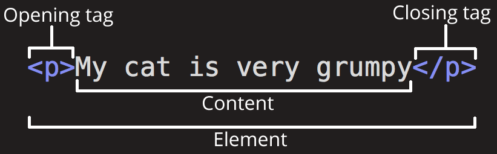
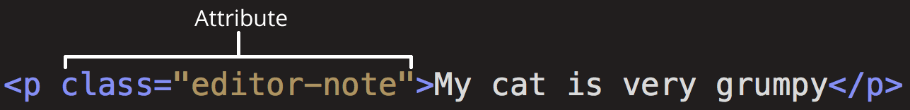

# 作业总结：
## 个人复盘
### 验证：
- HTML是什么，HTML5是什么
  - Hyper Text Markup Language 超文本标记语言
  - HTML5 是最新的 HTML 标准。
    - HTML5 是专门为承载丰富的 web 内容而设计的，并且无需额外插件。
    - HTML5 拥有新的语义、图形以及多媒体元素。
    - HTML5 提供的新元素和新的 API 简化了 web 应用程序的搭建。
    - HTML5 是跨平台的，被设计为在不同类型的硬件（PC、平板、手机、电视机等等）之上运行。
- HTML元素标签、属性都是什么概念？
  - 元素标签

  - 属性

- 文档类型是什么概念，起什么作用？
<!DOCTYPE> 声明帮助浏览器正确地显示网页。
- meta标签都用来做什么的？
元数据，描述数据的数据。
意义：描述文档的元数据，便于搜索引擎以及相关爬虫的抓取。
参看MDN的[概要解释](https://developer.mozilla.org/zh-CN/docs/Learn/HTML/Introduction_to_HTML/The_head_metadata_in_HTML)，以及[详细介绍](https://developer.mozilla.org/zh-CN/docs/Web/HTML/Element/meta)
- Web语义化是什么，是为了解决什么问题
让机器读懂内容
- 链接是什么概念，对应什么标签？
点击链接可以从一张页面跳转到另一张页面。参考顾轶灵[Semantic HTML](http://justineo.github.io/slideshows/semantic-html/#/5/1)
`<a>`
`<link> `
`<area>`

### 疑问：
处于语义化的考虑，样式交给CSS，我们应该专注HTML的内容文本书写，在写简历的时候产生了以下问题。

1. 简历里的“联系方式”是不是更适合使用MDN文档里提到[address](https://developer.mozilla.org/zh-CN/docs/Web/HTML/Element/address)元素？
MDN文档说明：
HTML有个用于标记联系方式的元素——address。它仅仅包含你的联系方式。
我用address元素包含了使用dt，dd 元素的联系方式
```<dl>
  <address>
      <dt>联系方式</dt>
      <dd>EMAIL:<a href="mailto">cc@gmail.com</a></dd>
      <dd>TEL:13200000000</dd>
      <dd>ADRESS:西北某省</dd>
      </address>
    </dl>
  ```
2. 教育背景及项目管理一栏使用 dl, dd, dt 合适吗？
MDN文档说明：
描述列表
在 HTML 基础部分，我们讨论了如何在 HTML 中标记基本的列表，但是我们没有提到你偶尔会遇到的第三种类型的列表—描述列表 (description list) 。这种列表的目的是标记一组项目及其相关描述，例如术语和定义，或者是问题和答案等。
```<h2>教育背景</h2>
<p>本科：汴梁大学</p>
<p>硕士：社会大学</p>
<h2>实习经历</h2>
<dl>
  <dt>搜兔公司</dt>
  <dd>2020.5-2021.7</dd>
  <dd>搜索引擎优化</dd>
  <dt>zotero公司</dt>
  <dd>2021.8-2022.9</dd>
  <dd>界面交互体验优化</dd>
</dl>
```   

## 再复盘
1. 参看其他同学的作业，发现本人对 `<dl><dt><dd>` 的语义理解与实际运用有误。不小心陷入用语义化词汇做样式化表现的思维。要多灵活运用有序、无序列表以及嵌套。
  >可查看 [张正全](http://ife.baidu.com/work/detail/id/3100) 的作业，以及下面赵赫的评语。作业简单，运用HTML5的语法规则，骨架清晰。  看得出来是认真翻阅了MDN文件。

2. 结合赵赫同学的评语修改后如下
```
<h2 id="education">教育背景</h2>
     <ol>
    <h3>本科：</h3>
       <p><time>2016.9</time>至<time>2020.6</time></p>
       <ul>
         <li>汴梁大学-XX专业</li>
         <li>卡基大学-XX专业</li>
       </ul>
    <h3>硕士：</h3>
      <p><time>2020.9</time>至<time>2023.6</time></p>
       <ul>
         <li>社会大学-XX专业</li>
       </ul>
      </ol>
    <h2 id="experience">实习经历</h2>
    <ol>
      <h3>搜兔公司</h3>
      <ul>
        <li><time>2020.5</time>至<time>2021.7</time></li>
      <li>搜索引擎优化</li>
      </ul>
      <h3>zotero</h3>
        <ul>
      <li><time>2021.8</time>至<time>2022.9</time></li>
      <li>界面交互体验优化</li>
        </ul>
      </ol>
    </ul>
```
---
# 课程备份
## 课程目标（day02）
  第二天，我们希望你能够通过简单的实践，更加清楚地了解HTML是什么，HTML5是什么。学习基本的HTML标签，理解HTML语义化概念

## 任务描述
  今天我们先暂时不用第一天让你安装的IDE，我们先暂时使用 codepen 作为我们的开发工具，打开 codepen，创建一个新的页面（Create->New Pen）。它有三个代码编写的窗口，分别是HTML，CSS，JS，下方是一个预览效果的窗口。我们今天只会涉及到 HTML。

  然后我们在 HTML 窗口中开始输入一些内容吧，我们假设现在要为自己创建一个在线简历，那简历都包含什么呢？给一些参考：

  包括“简历”两个字
  你的姓名，有可能只有姓名，有可能是 姓名：张三 这样的模式
  你的各种联系方式，比如：手机：18600000000，邮箱：joinefe@baidu.com
  你的学历，比如：本科：百度前端学院
  项目经验，比如：项目A：项目时间：2017.1-2017.8，项目描述：在项目A中负责了xxxxx
  你可以参考自己的简历内容，也可以参考网上一些热门简历内容，比如 羡辙 的简历（她简历的样式每年校招简历总能看见很多人在复用，所以，希望大家以后做简历的时候换个样式吧，哪怕是换个颜色也是极好的）。

  接下来，我们要把这些内容组装进一个HTML里面，这时候，你先不要考虑这个简历会长什么样，你重点要放在一个哲学问题上，就是简历里面的每个内容，它是什么。也许你还没太懂啥意思，所以，先看看下面几个内容。

### 阅读
  首先阅读 W3School的HTML教学 把HTML的各个标签再学习一遍，当然看 MDN 或者能力强的同学直接看 W3C 也是没问题的。

  接下来，理解一下 顾轶灵的如何理解 Web 语义化？，如果没有看太懂，可以再自行搜索一下“Web语义化”相关文章内容

  在整个阅读过程中，你可以一边看，一边想想，你之前准备的简历的每个内容，应该用什么样的HTML元素、标签比较合适。

### 编码
  阅读完以后，我们继续回到codepen。现在你需要把你之前想到的简历内容的每一个内容拆解到对应的HTML元素，你需要考虑很多问题，举几个例子：

  大标题“简历”二字，是否适合使用`<h1>/<h2>`之类的标题元素
  “姓名：张三”这几个字，我是用一个`<xxx>`元素呢？还是拆成`<yyy>姓名</yyy><zzz>张三</zzz>`。（xxx，yyy，zzz均为示意）
  “项目经验：A项目，xxxx，B项目，xxxxx”这部分内容结构有点小复杂，怎么用合适的HTML元素来组装呢？
  在这个过程中，需要注意的事儿，你要考虑的主要问题，就是为你的内容找到语义合适的HTML元素，暂时不要考虑样式的问题，切记。

  好的，愉快地写代码吧，内容不需要太多，这段编码时间别超过 2 个小时。上个闹钟，如果超过了，暂停一下，重新去阅读一下上面的参考资料，看看自己有没有实现得不合理的地方，然后优化一下。

  注意别暴露自己隐私，里面数据用虚假的即可，当然，如果你想当网红或者希望更多人认识你，请随意。

### 提交
  把你的 codepen 地址提交到作业里，因为是codepen，所以代码地址和预览地址一样即可。

### 重构
  估计今天还剩下几个小时，交流完的你，不妨再多看一些文章和书籍，然后重新看一遍自己的代码，优化一下，我们把这个叫做重构（有可能是重写……），一遍又一遍觉得自己代码太丢人，然后优化它，是最好的成长方式之一。

### 交流
  找到几个 QQ 群或者微信群，最好是找几个周围的小伙伴，彼此交流一下，互相Review一下代码，也可以在作业提交list里随便找一些同学的代码看看。

### 验证
  来最后小验证一下，你是否能流畅地回答以下问题：

  HTML是什么，HTML5是什么
  HTML元素标签、属性都是什么概念？
  文档类型是什么概念，起什么作用？
  meta标签都用来做什么的？
  Web语义化是什么，是为了解决什么问题
  链接是什么概念，对应什么标签？
  常用标签都有哪些，都适合用在什么场景
  表单标签都有哪些，对应着什么功能，都有哪些属性
  ol, ul, li, dl, dd, dt等这些标签都适合用在什么地方，举个例子
