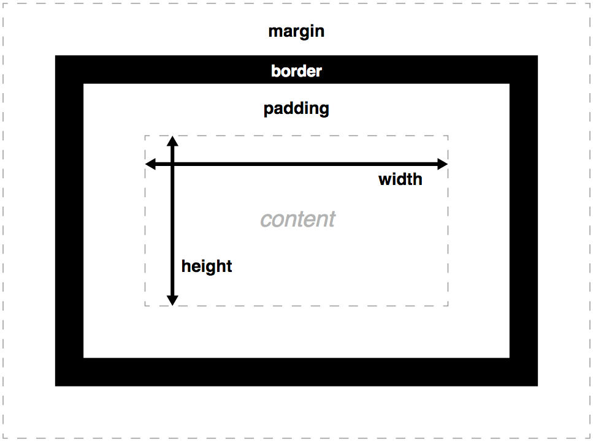
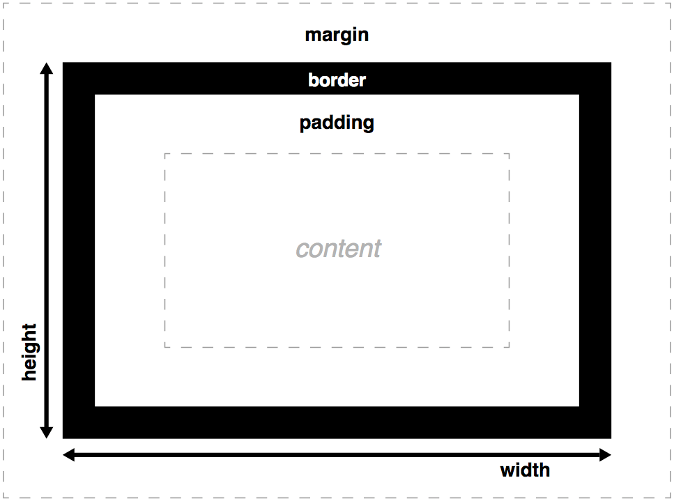

## 1.框模型（box）
原型如下，可用开发者工具查看：

框默认宽度=margin-left + border-left + padding-left +width + padding-right + border-right + margin-right
1.1 内容区：
内容框是框内容显示的区域——包括框内的文本内容，以及表示嵌套子元素的其它框。
tips.
1.11 默认情况下`width` 和 `height` 只包括内容框（content box）的宽度和高度，不包括`border`、`padding`、`margin`。
使用`box-sizing`可以使其包含content、padding、border
`box-sizing`的值：
 ```
/* 默认值，标准框模型，只含内容区 */
box-sizing: content-box;
/* width 和 height 属性包括内容，内边距和边框，但不包括外边距 */
box-sizing: border-box;
```

1.12. 通过属性`min-width`、`max-width`、`min-height` 和 `max-height`来设置最低/最高限度的width和height。
```
width: 70%;
max-width: 1280px;
min-width: 480px;
margin: 0 auto;

```
呈现效果是：当父容器在最小和最大宽度限制内时，它将填满整个视口宽度；当父容器超过1280px宽度时，布局将保持在1280px宽，并开始在可用空间内居中。 当宽度低于480px时，视口将小于容器，您必须滚动才能看得到完全的内容。可见直观案例：[eg1](https://mdn.github.io/learning-area/css/styling-boxes/box-model-recap/min-max-container.html)

max-width属性的另一个好处是可以将容器内的媒体（例如图像和视频）控制在容器内。 回到上面的例子，图像会引起一个问题——起初它的显示正常，但当容器变得比图像更窄时，图像开始溢流容器（因为它是一个固定的宽度）。
要应对这类图像的问题，我们可以在其上设置以下声明：
```
display: block;
margin: 0 auto;
max-width: 100%;
```
可见直观案例：[eg2](https://mdn.github.io/learning-area/css/styling-boxes/box-model-recap/min-max-image-container.html)

1.2. padding：
 CSS 框的内边距
1.3. border：
CSS 框的边框，位于内边距的外边缘以及外边距的内边缘之间。边界的默认大小为0。
1.4. margin：
 CSS 框周围的外部区域，称为外边距，它在布局中推开其它 CSS 框。其表现与 padding 很相似。
 tips.外边距塌陷: 块级元素的上外边距和下外边距有时会合并（或折叠）为一个外边距，其大小取其中的最大者。
 1.4.1. 相邻兄弟元素margin合并；
 1.4.2. 父级和第一个/最后一个子元素；
 1.4.3. 空块级元素的margin合并。

1.5. 注意点：
1.5.1.框的高度不能使用百分比长度。如果框的高度设置为百分比长度，那么框高度不会遵循百分比长度，而是总会采用框内容的高度。
1.5.2.border不能使用百分比长度。
1.5.3.如果内容区过大，将会溢出，此时可使用overflow
overflow的值：
```
/* 默认值。内容不会被修剪，会呈现在元素框之外  */
overflow: visible;
/* 内容会被修剪，并且其余内容不可见  */
overflow: hidden;
/* 内容会被修剪，浏览器会显示滚动条以便查看其余内容  */
overflow: scroll;
/* 由浏览器定夺，如果内容被修剪，就会显示滚动条  */
overflow: auto;
```
1.6.框类型`display`的值：
值|说明
-|:-
block  |  块框（ block box）是定义为堆放在其他框上的框（例如：其内容会独占一行），而且可以设置它的宽高，之前所有对于框模型的应用适用于块框 （ block box）。
inline  | 行内盒（inline box）与块盒相反：它跟随文档的文本流堆放（即，它会与周围的文本和其它行内元素出现在同一行，并且其内容会像段落中的文本行一样，随着文本流换行）。宽度和高度设置对行内盒无效；在行内盒上的所有内边距、外边距和边界设置会改变周围文本的位置，但是不会影响周围块盒的位置。  
inline-block  |  行内块盒（inline-block box）介于前两者之间： 它会像行内盒一样，跟随周围的文本流堆放，不会在其前后创建换行；不过，它可以像块盒一样，使用宽度和高度设置大小，并且维护其块完整性 — 它不会跨段落行换行（对于一行文本容纳不下的行内盒，会落到第二行上，因为第一行上没有足够的空间容纳它，并且不会跨两行换行）。（比较inline-block与float的运用）
table  |  像处理table布局那样处理非table元素，而不是滥用HTML的table标签来达到同样的目的。
flex  |  处理一些困扰CSS已久的一些传统布局问题，例如布置一系列弹性等宽容器或者垂直居中内容。
 grid  |  给出一种简单实现CSS网格系统的方式，而在传统上它依赖于一些棘手难以处理的CSS网格框架。
## 2. 浮动
2.1 浮动的背景和工作原理
浮动的最初是用来让**文字环绕图片**.
浮动会脱离正常的文档流，并吸附到其父容器一边，正常布局中位于浮动元素下的内容会围绕着浮动元素。
2.2 浮动的“包裹性”
浮动就是个带有方位的 `display:inline-block` 属性。 `display:inline-block` 某种意义上的作用就是包裹(wrap)。
2.3 浮动的”破坏性“
浮动破坏了正常的line boxes。
2.2 清除浮动的方法
2.2.1. 投机取巧法
   父元素底部加上<div style="clear:both;"></div>，易于理解。虽说兼容性好，但是浪费一个标签，违反了语义化，不推荐
2.2.2. overflow + zoom方法
  ```
  .fix{overflow:hidden; zoom:1;}
  ```
不定时炸弹，慎用。
2.2.3. after + zoom方法
借鉴了 1.投机取巧的方法 的原理，通过CSS来添加子元素，不修改HTML代码 ——`:after` 选择符
```
.clearfix:after {
    content: " ";  //content可以任意发挥
    display: block;
    line-height: 0;  //height: 0也行
    clear: both;
}
.clearfix {
    zoom: 1;
}
```
这个方法最佳, 推荐这个方法

##  参考：
[CSS float浮动的深入研究、详解及拓展(一)](http://www.zhangxinxu.com/wordpress/2010/01/css-float%E6%B5%AE%E5%8A%A8%E7%9A%84%E6%B7%B1%E5%85%A5%E7%A0%94%E7%A9%B6%E3%80%81%E8%AF%A6%E8%A7%A3%E5%8F%8A%E6%8B%93%E5%B1%95%E4%B8%80/)
[CSS float浮动的深入研究、详解及拓展(二)](http://www.zhangxinxu.com/wordpress/2010/01/css-float%E6%B5%AE%E5%8A%A8%E7%9A%84%E6%B7%B1%E5%85%A5%E7%A0%94%E7%A9%B6%E3%80%81%E8%AF%A6%E8%A7%A3%E5%8F%8A%E6%8B%93%E5%B1%95%E4%BA%8C/)
[俞綮源的第五天和第六天的笔记](http://ife.baidu.com/note/detail/id/959)
